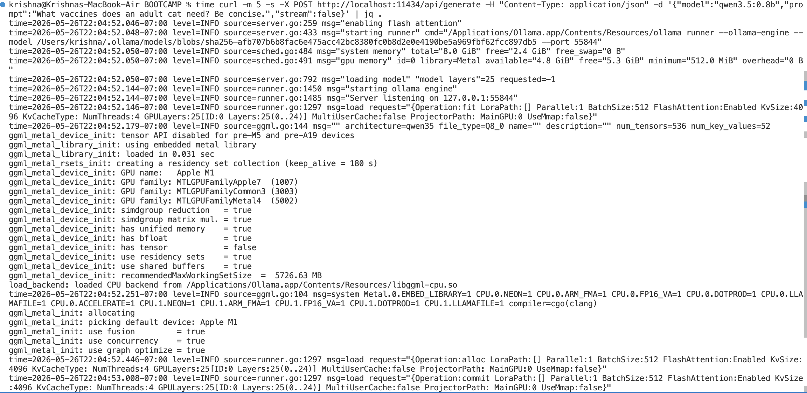
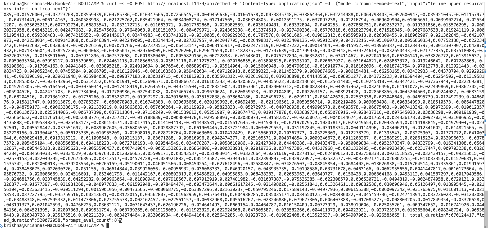
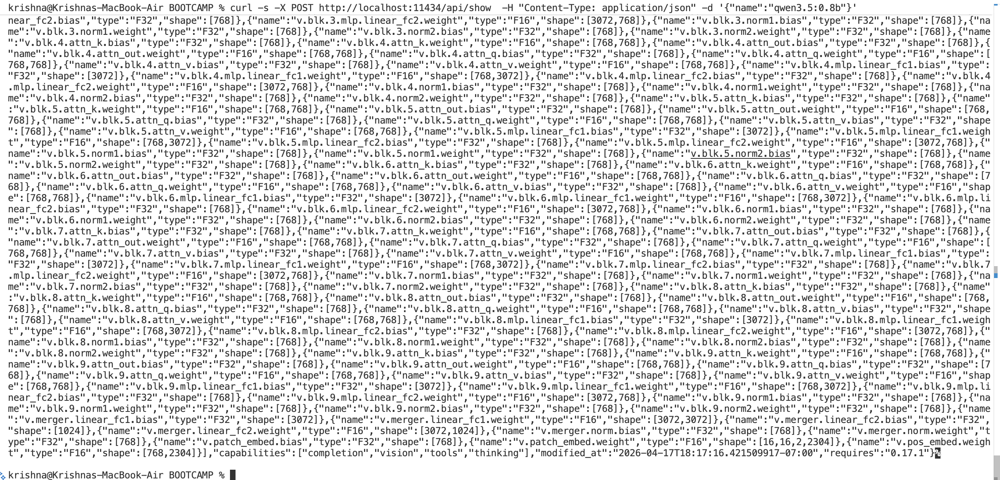
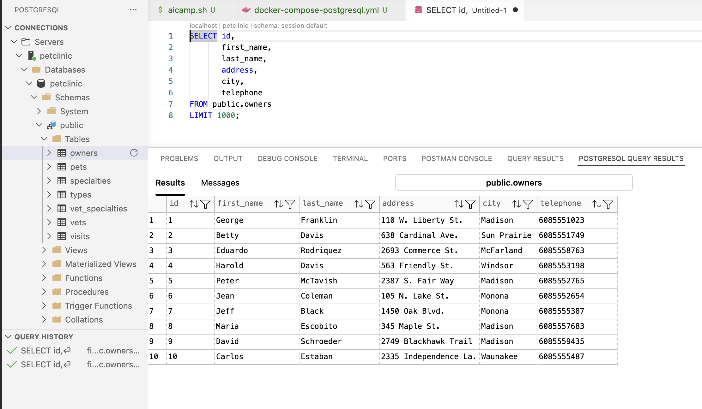

# DAY 1: Foundation — Local AI + First AI Feature + RAG

**Theme:** "From zero to a working AI chat assistant with RAG in one day"

---

## 09:00 – 10:00 | Day 1 Intro & Setup Validation

**Presenter:** Anil Kumar Veldurthi

### Agenda
- Welcome + bootcamp objectives and outcomes
- Why this book was written: the local-first AI thesis
- Architecture overview: the full PetClinic AI stack
- Setup validation — everyone runs the smoke test together

### Setup Smoke Test (all participants run simultaneously)

#### 1. Verify Ollama
```bash
curl http://localhost:11434/api/tags
```


#### 2. Quick inference test
```bash
curl -m 5 -s -X POST http://localhost:11434/api/generate -H "Content-Type: application/json" -d '{"model":"qwen3.5:0.8b","prompt":"Say: PetClinic AI is ready.","stream":false}'
```


#### 3. Start the PetClinic stack
```bash
cd spring-petclinic
mvn spring-boot:run -Dspring.profiles.active=local
```


##### 🚨 FAILED to start PetClinic


**_⚠️ Kill the port_**
```bash
kill -9 $(lsof -t -i:8080)
```


#### 4. Verify app started
```bash
curl http://localhost:8080/actuator/health
```


---

## 10:00 – 11:30 | Session 1 — Why Local-First AI + Spring PetClinic Architecture

**Chapters Covered:** 0, 1, 2, 3

### Presentation (35 min)
- **Ch 0:** The local-first AI argument — data sovereignty, cost crossover at 1,900 req/day, vendor independence
- **Ch 1:** Why every enterprise application needs AI — from reactive to proactive systems
- **Ch 2:** PetClinic domain model — Owners, Pets, Vets, Visits, and why it's the perfect AI testbed
- **Ch 3:** Model selection framework — qwen3.5:0.8b on CPU vs GPU, quantization (Q4_K_M default), nomic-embed-text

### Live Demo (25 min)

#### DEMO 1: Model comparison — quality vs speed
- Run inference and measure time
```bash
time curl -m 5 -s -X POST http://localhost:11434/api/generate -H "Content-Type: application/json" -d '{"model":"qwen3.5:0.8b","prompt":"What vaccines does an adult cat need? Be concise.","stream":false}' | jq '.response'
```


#### DEMO 2: Embedding generation — nomic-embed-text
```bash
curl -s -X POST http://localhost:11434/api/embed -H "Content-Type: application/json" -d '{"model":"nomic-embed-text","input":"feline upper respiratory infection treatment"}' \
  | jq '.embeddings[0][0:5]'
```


#### DEMO 3: Model details
```bash
curl -s -X POST http://localhost:11434/api/show  -H "Content-Type: application/json" -d '{"name":"qwen3.5:0.8b"}' | jq '{model:.modelfile,size:.size}'
```


#### DEMO 4: Inspect PetClinic schema
```bash
psql -h localhost -U petclinic -d petclinic -c "\dt" -c "SELECT count(*) as owners FROM owners;"
```


### Hands-On Lab 1A — Model Benchmarking (30 min)

**Objective:** Run 5 veterinary queries and measure latency + quality

```bash
# Lab 1A: benchmark_queries.sh
#!/bin/bash

QUERIES=(
  "Is ibuprofen safe for dogs?"
  "What are symptoms of feline diabetes?"
  "How often should I vaccinate my rabbit?"
  "My cat has been vomiting for 2 days. What should I do?"
  "What is the recommended dose of amoxicillin for a 10kg dog?"
)

for q in "${QUERIES[@]}"; do
  echo "QUERY: $q"
  START=$(date +%s%N)
  RESPONSE=$(curl -s -X POST http://localhost:11434/api/generate \
    -H "Content-Type: application/json" \
    -d "{\"model\":\"qwen3.5:0.8b\",\"prompt\":\"$q Answer in 2 sentences.\",\"stream\":false}")
  END=$(date +%s%N)
  MS=$(( (END - START) / 1000000 ))
  echo "RESPONSE: $(echo $RESPONSE | jq -r '.response')"
  echo "TIME: ${MS}ms"
  echo "---"
done
```

**Lab Deliverable:** Screenshot of 5 query results + latency table in your notes

---

## 12:00 – 12:30 | Lunch

---

## 12:30 – 14:00 | Session 2 — Spring AI Integration + First Chat Assistant

**Chapters Covered:** 4, 5

### Presentation (30 min)
- **Ch 4:** ADR-001: Spring AI vs LangChain4j vs Direct REST — why Spring AI wins on MCP support
- **Ch 5:** Building VetAssistantService — AICompletionPort abstraction, stateless vs stateful chat, SSE streaming

### Live Demo (25 min)
```bash
# DEMO 5: First AI chat endpoint — live coding from scratch
# Open VetAssistantController.java and walk through:

# Test stateless chat
curl -X POST http://localhost:8080/api/v1/ai/chat \
  -H "Content-Type: application/json" \
  -d '{"message": "What vaccines does Luna my 3-year-old cat need?"}'

# Test stateful chat (session continuity)
SESSION_ID="demo-$(date +%s)"
curl -X POST http://localhost:8080/api/v1/ai/chat \
  -H "Content-Type: application/json" \
  -d "{\"message\": \"My cat is Luna, she is 3 years old.\", \"sessionId\": \"$SESSION_ID\"}"

curl -X POST http://localhost:8080/api/v1/ai/chat \
  -H "Content-Type: application/json" \
  -d "{\"message\": \"What vaccines does she need?\", \"sessionId\": \"$SESSION_ID\"}"

# DEMO 6: SSE streaming
curl -N -X POST http://localhost:8080/api/v1/ai/chat/stream \
  -H "Content-Type: application/json" \
  -d '{"message": "Explain feline diabetes in 3 sentences.", "sessionId": "stream-demo"}'
```

### Hands-On Lab 1B — Build the Vet Chat Assistant (35 min)

**Objective:** Wire up VetAssistantService from scratch using the AICompletionPort abstraction

```java
// LAB 1B: Complete this implementation
// File: src/main/java/petclinic/ai/VetAssistantService.java

@Service
public class VetAssistantService {

    private final AICompletionPort completionPort;
    private final ConversationMemoryService memoryService;

    // TODO 1: Inject dependencies via constructor

    public ChatResponse chat(String sessionId, String userMessage) {
        // TODO 2: Load conversation history from memoryService
        // TODO 3: Build system prompt using VetAssistantPrompts.SYSTEM_PROMPT_V1_4
        // TODO 4: Call completionPort.chat(systemPrompt, history, userMessage)
        // TODO 5: Save updated history to memoryService
        // TODO 6: Return ChatResponse with message and sessionId
        return null; // replace
    }
}

// Test your implementation:
// curl -X POST http://localhost:8080/api/v1/ai/chat \
//   -H "Content-Type: application/json" \
//   -d '{"message":"Is chocolate toxic to dogs?","sessionId":"lab-1b"}'
```

---

## 14:15 – 16:00 | Session 3 — RAG Pipeline

**Chapters Covered:** 6

### Presentation (35 min)
- **Ch 6:** RAG architecture — why LLMs hallucinate without grounding
- Chunking strategy for veterinary documents — 512 token chunks, 64 token overlap
- pgvector hybrid search: embedding similarity + BM25 keyword fusion (RRF)
- Multi-tenant SearchFilter — clinicId isolation
- Hallucination reduction measurement before/after RAG

### Live Demo (30 min)
```bash
# DEMO 7: Index clinical documents
curl -X POST http://localhost:8080/api/v1/rag/ingest \
  -H "Content-Type: application/json" \
  -d '{"documentPath": "classpath:clinical-protocols/vaccination-schedule.pdf","clinicId": 1}'

# DEMO 8: Vector search — semantic
curl -X POST http://localhost:8080/api/v1/rag/search \
  -H "Content-Type: application/json" \
  -d '{"query": "feline upper respiratory treatment protocol","clinicId": 1,"topK": 3}'

# DEMO 9: Grounded response vs. non-grounded
echo "=== WITHOUT RAG (hallucination risk) ==="
curl -s -X POST http://localhost:11434/api/generate \
  -d '{"model":"qwen3.5:0.8b","prompt":"What is our clinic protocol for treating feline URIs?","stream":false}' | jq -r '.response'

echo "=== WITH RAG (grounded) ==="
curl -X POST http://localhost:8080/api/v1/ai/chat/grounded \
  -H "Content-Type: application/json" \
  -d '{"message":"What is our clinic protocol for treating feline URIs?","sessionId":"rag-demo","clinicId":1}'

# DEMO 10: Check pgvector data
psql -h localhost -U petclinic -d petclinic \
  -c "SELECT id, content[1:80] as snippet, clinic_id FROM vector_store LIMIT 5;"
```

### Hands-On Lab 1C — RAG Pipeline End-to-End (40 min)

**Objective:** Ingest 3 documents and verify grounded vs. ungrounded responses

```bash
# Step 1: Ingest your documents
for doc in vaccination-schedule flea-treatment dental-protocol; do
  curl -X POST http://localhost:8080/api/v1/rag/ingest \
    -H "Content-Type: application/json" \
    -d "{\"documentPath\":\"classpath:clinical-protocols/${doc}.pdf\",\"clinicId\":1}"
  echo "Ingested: $doc"
done

# Step 2: Run comparison test
python3 lab1c_rag_comparison.py
# Script asks 5 clinical questions and compares:
#   - Raw LLM response (no RAG)
#   - RAG-grounded response
# Measures: contains_citation, response_length, hallucination_keywords

# Step 3: Check chunk count
psql -h localhost -U petclinic -d petclinic \
  -c "SELECT count(*) as total_chunks FROM vector_store WHERE clinic_id=1;"
```

---

## 16:00 – 17:00 | Day 1 Wrap

**Retrospective:**
- What was clear? What was confusing?
- Live Q&A on RAG, Spring AI, model selection
- Preview of Day 2: Agents and Multi-Agent workflows

---

---