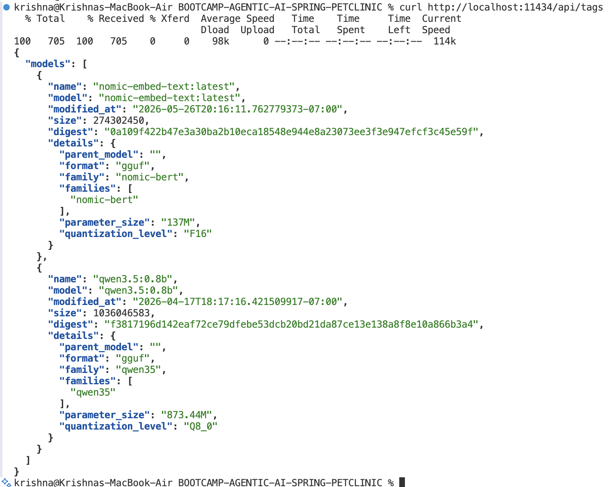
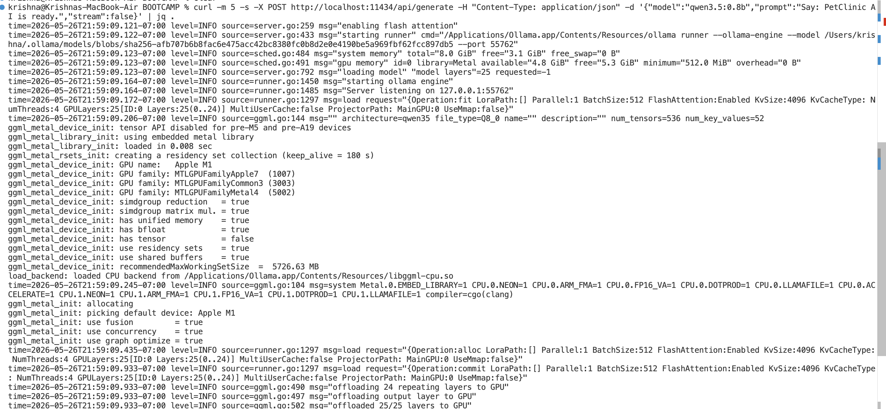
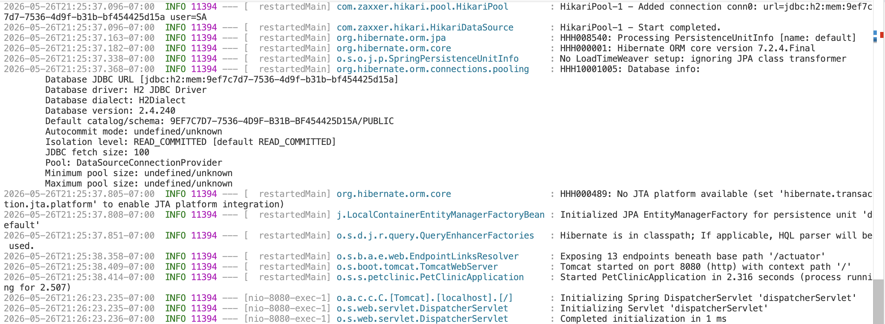
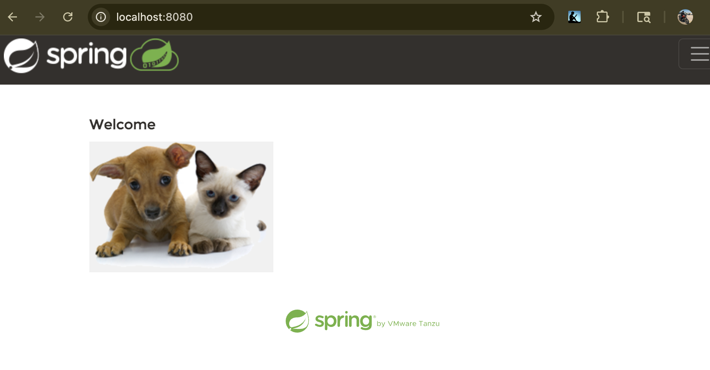
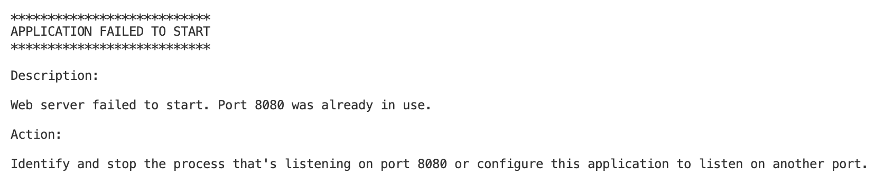
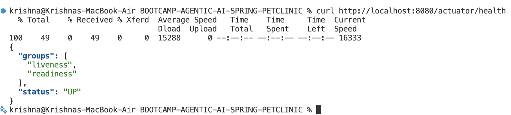

# DAY 1: Foundation — Local AI + First AI Feature + RAG

**Theme:** "From zero to a working AI chat assistant with RAG in one day"

---

## 09:00 – 10:00 | Day 1 Intro & Setup Validation

**Presenter:** Anil Kumar Veldurthi

### Agenda
- Welcome + bootcamp objectives and outcomes
- Why this book was written: the local-first AI thesis
- Architecture overview: the full PetClinic AI stack
- Setup validation — everyone runs the smoke test together

### Setup Smoke Test (all participants run simultaneously)

#### 1. Verify Ollama
```bash
curl http://localhost:11434/api/tags
```



#### 2. Quick inference test
```bash
curl -m 5 -s -X POST http://localhost:11434/api/generate -H "Content-Type: application/json" -d '{"model":"qwen3.5:0.8b","prompt":"Say: PetClinic AI is ready.","stream":false}'
```


#### 3. Start the PetClinic stack
```bash
cd spring-petclinic
mvn spring-boot:run -Dspring.profiles.active=local
```



##### 🚨 FAILED to start PetClinic


**_⚠️ Kill the port_**
```bash
kill -9 $(lsof -t -i:8080)
```


#### 4. Verify app started
```bash
curl http://localhost:8080/actuator/health
```


---

## 10:00 – 11:30 | [Session 1 — Why Local-First AI + Spring PetClinic Architecture](./SESSION-1/README.md)

---

## 12:00 – 12:30 | Lunch

---

## 12:30 – 14:00 | [Session 2 — Spring AI Integration + First Chat Assistant](./SESSION-2/README.md)

---

## 14:15 – 16:00 | [Session 3 — RAG Pipeline](./SESSION-3/README.md)

---

## 16:00 – 17:00 | Day 1 Wrap

**Retrospective:**
- What was clear? What was confusing?
- Live Q&A on RAG, Spring AI, model selection
- Preview of Day 2: Agents and Multi-Agent workflows

---

---