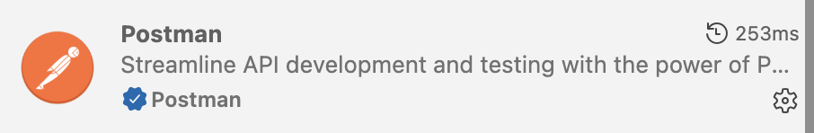
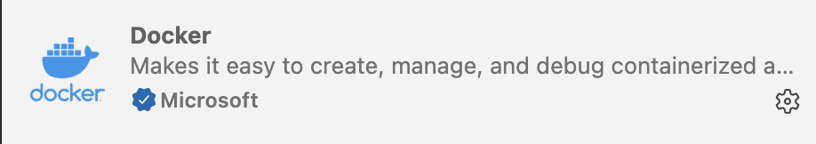
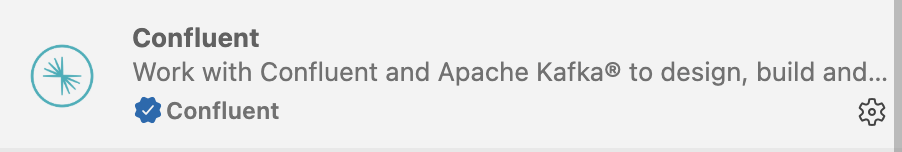
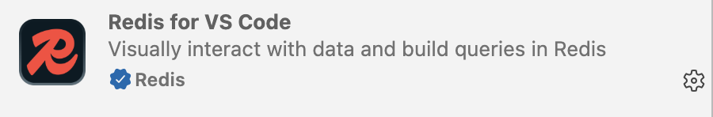
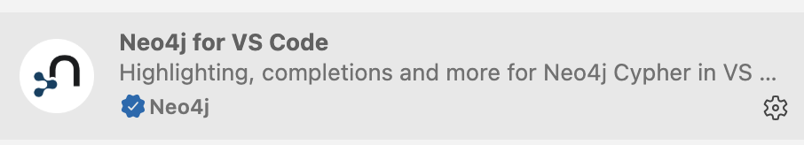
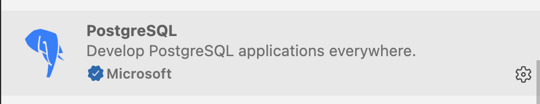

## Prerequisites for BOOTCAMP

**Before Day 1 — participants must have:**
- Java 25 + Apache Maven 3.9+ installed
- Docker Desktop running (8GB+ RAM allocated)
- Git 
- IDE `VS Code` with extensions: 
    - Postman
    
    - Docker
    
    - Container Tools
    
    - Kafka
    
    - Redis
    
    - Neo4J
    
    - Postgres
    

- Ollama installed: `curl -fsSL https://ollama.ai/install.sh | sh`
    - Models pre-pulled (do this before arrival — ~1.25GB total):
  ```bash
  ollama pull qwen3.5:0.8b
  ollama pull nomic-embed-text
  ```

- Clone the starter repo:
  ```bash
  git clone -b bootcamp https://github.com/krishnamanchikalapudi/spring-petclinic.git
  ```

---

GO TO **[README](./README.md)**