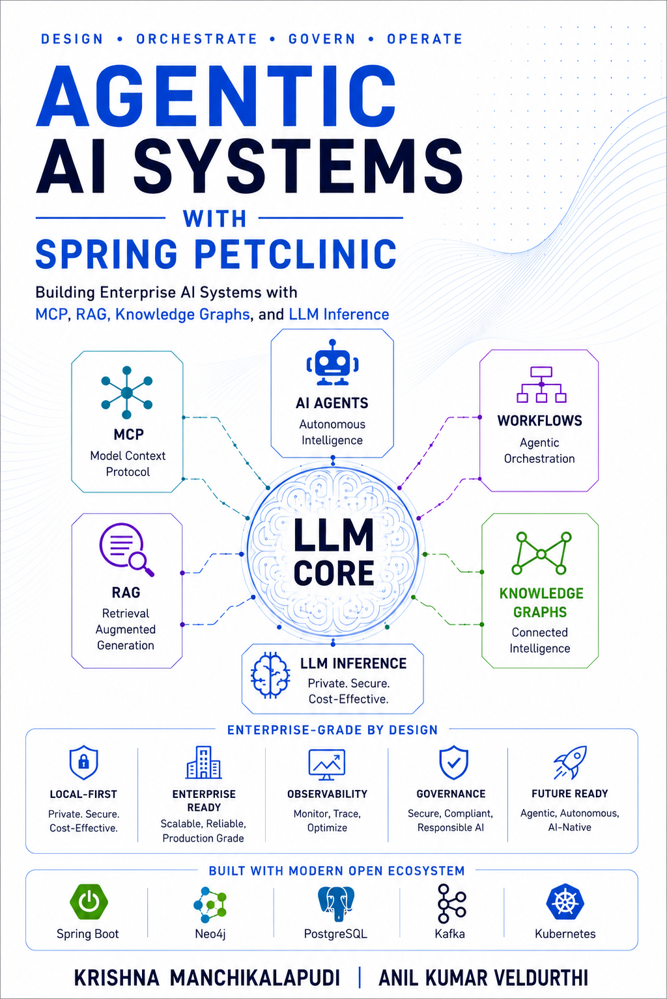
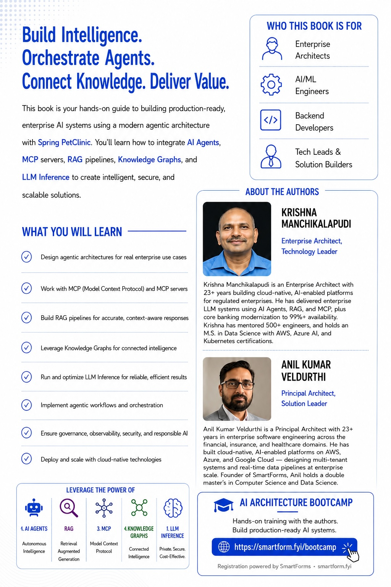

# BOOTCAMP: Agentic AI Systems with Spring PetClinic

<a href="https://a.co/d/04n6VGZM" target='_new'>
<table>
<tr>
<td></td>
<td></td>
</tr>
</table>
</a>

### 4-Day Hands-On Bootcamp
- **Authors:** Anil Kumar Veldurthi, Krishna Manchikalapudi  
- **Format:** In-person / Virtual instructor-led  
- **Stack:** Follow the [prequisite](./PRE-STEP.md) instructions

---

## Daily Schedule Template

| Time | Block | Duration |
|---|---|---|
| 09:00 – 10:00 | Intro / Day Kickoff | 60 min |
| 10:00 – 11:30 | **Session 1** | 90 min |
| 11:30 – 11:45 | Break + Q&A | 15 min |
| 11:45 – 12:00 | Buffer / Catch-up Lab | 15 min |
| 12:00 – 12:30 | Lunch for In-person attendee | 30 min |
| 12:30 – 14:00 | **Session 2** | 90 min |
| 14:00 – 14:15 | Break + Coffee + Q&A | 15 min |
| 14:15 – 16:00 | **Session 3** | 105 min |
| 16:00 – 17:00 | Day Wrap / Questions / Retrospective | 60 min |

> Each session = **Presentation (30–40 min)** + **Live Demo (20–25 min)** + **Hands-On Lab (25–30 min)**

---


# Demo & Hands-On Session Index

## Complete Demo Index (43 demos over 4 days)

| Demo # | Day | Session | Topic | Chapter |
|---|---|---|---|---|
| D01 | 1 | 1 | Ollama inference + timing | Ch 3 |
| D02 | 1 | 1 | Embedding generation | Ch 3 |
| D03 | 1 | 1 | Model details inspection | Ch 3 |
| D04 | 1 | 1 | PetClinic schema exploration | Ch 2 |
| D05 | 1 | 2 | First chat endpoint live coding | Ch 5 |
| D06 | 1 | 2 | SSE streaming response | Ch 5 |
| D07 | 1 | 3 | Document ingestion pipeline | Ch 6 |
| D08 | 1 | 3 | Vector similarity search | Ch 6 |
| D09 | 1 | 3 | Grounded vs ungrounded response | Ch 6 |
| D10 | 1 | 3 | pgvector data inspection | Ch 6 |
| D11 | 2 | 4 | ReAct agent execution (THOUGHT/TOOL loop) | Ch 7 |
| D12 | 2 | 4 | Circuit breaker — tool failure graceful degradation | Ch 7 |
| D13 | 2 | 4 | Multi-turn agent memory | Ch 8 |
| D14 | 2 | 4 | Redis session inspection | Ch 8 |
| D15 | 2 | 5 | Single agent booking flow | Ch 9 |
| D16 | 2 | 5 | Multi-agent post-visit workflow | Ch 10 |
| D17 | 2 | 5 | Coordinator state in PostgreSQL | Ch 10 |
| D18 | 2 | 6 | Human approval gate — prescription | Ch 12 |
| D19 | 2 | 6 | Emergency triage via Kafka | Ch 13 |
| D20 | 2 | 6 | MCP tool discovery | Ch 14 |
| D21 | 3 | 7 | Neo4j schema exploration | Ch 17 |
| D22 | 3 | 7 | Drug interaction + breed predisposition queries | Ch 18 |
| D23 | 3 | 7 | GraphRAG vs plain RAG comparison | Ch 19 |
| D24 | 3 | 7 | Reasoning path inspection | Ch 19 |
| D25 | 3 | 8 | Prometheus metrics live scrape | Ch 20 |
| D26 | 3 | 8 | Grafana dashboard walkthrough | Ch 20 |
| D27 | 3 | 8 | Langfuse trace inspection | Ch 20 |
| D28 | 3 | 8 | Drift detection report | Ch 20 |
| D29 | 3 | 9 | Full AI quality gate test run | Ch 21 |
| D30 | 3 | 9 | Prompt injection attempts + detection | Ch 22 |
| D31 | 3 | 9 | Compliance audit log inspection | Ch 23 |
| D32 | 3 | 9 | Model card generation | Ch 23 |
| D33 | 4 | 10 | Docker stack build + compose | Ch 24 |
| D34 | 4 | 10 | Kubernetes Helm deploy + pod watch | Ch 25 |
| D35 | 4 | 10 | HPA scale-out under load | Ch 25 |
| D36 | 4 | 11 | ArgoCD sync + GitOps deploy | Ch 26 |
| D37 | 4 | 11 | Tekton pipeline run | Ch 26 |
| D38 | 4 | 11 | FinOps executive summary | Ch 27 |
| D39 | 4 | 11 | Semantic cache hit demonstration | Ch 27 |
| D40 | 4 | 12 | SLO compliance dashboard | Ch 28 |
| D41 | 4 | 12 | Error budget status | Ch 28 |
| D42 | 4 | 12 | P1 incident simulation: Ollama down (RB-01) | Ch 28 |
| D43 | 4 | 12 | Capacity planning report | Ch 28 |

---

## Complete Hands-On Lab Index (12 labs over 4 days)

| Lab | Day | Session | Objective | Deliverable |
|---|---|---|---|---|
| 1A | 1 | 1 | Benchmark 5 veterinary queries | Latency table + screenshot |
| 1B | 1 | 2 | Build VetAssistantService | Working chat endpoint |
| 1C | 1 | 3 | RAG pipeline end-to-end | 3 documents ingested + comparison |
| 2A | 2 | 4 | Build ReAct Agent executor | Booking agent running |
| 2B | 2 | 5 | Trigger multi-agent workflow | 3 workflows completed |
| 2C | 2 | 6 | MCP tool calls with OAuth2 scopes | Scope rejection verified |
| 3A | 3 | 7 | Neo4j Cypher queries + GraphRAG | 4 queries + cited response |
| 3B | 3 | 8 | Build custom Grafana panel | Panel with P95 + cost metrics |
| 3C | 3 | 9 | Golden-set entries + injection scan | 3 new entries + security log |
| 4A | 4 | 10 | Helm values customization | Custom bootcamp values deployed |
| 4B | 4 | 11 | Trigger automatic rollback | Rollback log confirmed |
| 4C | 4 | 12 | Capstone: full system flow | All 7 steps completed |

---

## Environment Setup Reference

### BOOTCAMP QUICK-START (run before Day 1)

#### 1. Models
- https://ollama.com/library/qwen3.5
- https://ollama.com/library/nomic-embed-text
```bash
ollama pull qwen3.5:0.8b
ollama pull nomic-embed-tex
```

#### 2. Clone repo
```bash
git clone https://github.com/krishnamanchikalapudi/spring-petclinic.git
cd spring-petclinic
git checkout bootcamp
```

#### 3. Full stack
 - Services: 
  - PostgreSQL + pgvector
  - Neo4j
  - Redis
  - Kafka,
  - Prometheus
  - Grafana
  - Langfuse
  
##### PostgreSQL + pgvector
```bash
docker-compose -f "./BOOTCAMP/docker-compose-postgresql.yml" up -d
```

#### 4. Load seed data
```bash
mvn flyway:migrate -Dspring.profiles.active=bootcamp
psql -h localhost -U petclinic -d petclinic -f db/seed/bootcamp-data.sql
```

#### 5. Verify all services
```bash
docker-compose -f docker-compose-bootcamp.yml ps
curl http://localhost:8080/actuator/health
curl http://localhost:7474   # Neo4j Browser
curl http://localhost:3000   # Grafana (admin/petclinic)
curl http://localhost:3100   # Langfuse
curl http://localhost:9090   # Prometheus
curl http://localhost:11434/api/tags  # Ollama
```
# All green? Ready for Day 1.


---

*Practitioner's Guide to Agentic Architecture on Spring PetClinic — 4-Day Bootcamp*  
*Anil Kumar Veldurthi, Krishna Manchikalapudi*
