# Spring PetClinic — AI Capabilities

Adds a **floating AI chat assistant** powered by a **locally-running Ollama instance** to every page. No cloud API keys required — everything runs on your machine.

 - GitHub Action status: [](https://github.com/krishnamanchikalapudi/spring-petclinic/actions/workflows/mypipeline.yml)

## Feature 1: AI Chat using Ollama service
### Architecture

```
Browser ── POST /api/ai/chat ──►  AiChatController  ──►  AiContextService ──►  Ollama (localhost:11434)
         ◄── { "reply": "…" } ──────────────────────────────────────────────────────────
```

The Spring backend also exposes `GET /api/ai/health` which the chat panel calls
on page load to show the active model name (or an "offline" indicator).

---
### Quick-start

#### Install Ollama

##### macOS / Linux
```bash
curl -fsSL https://ollama.com/install.sh | sh
```
##### Windows 
 - download from [https://ollama.com/download](https://ollama.com/download)


#### Start Ollama and pull a model
 - https://ollama.com/models
```bash
ollama serve            # starts the local API on port 11434

# In a second terminal:
ollama pull qwen3.5:0.8b     # ~1 GB, excellent instruction-following
# or
ollama pull llama3.2:1b    # ~1.3 GB, fast & capable (recommended default)
# or
ollama pull phi3.5:latest        # tiny, runs on any hardware
```
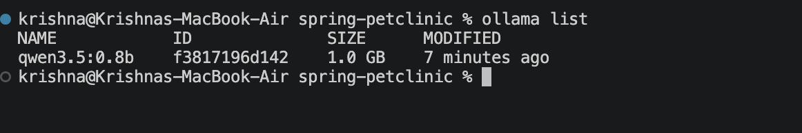

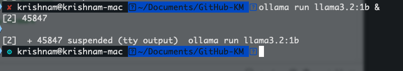

### Feature code
 - New files:
     - src/main/resources/templates/fragments/ai-chat.html 
     - src/main/java/org/springframework/samples/petclinic/ai/system/AiChatController.java
     - src/main/java/org/springframework/samples/petclinic/ai/system/AiContextService.java
     - src/main/resources/application-ollama.properties
 - Updated files:
    - src/main/resources/templates/fragments/layout.html
        - `<div th:replace="~{fragments/ai-chat :: aiChat}">`
```
spring-petclinic/
└── src/
    ├── main/resources
    │   └── application-ollama.properties
    ├── main/resources/templates/fragments/
    │   └── layout.html
    │   └── ai-chat.html             
    └── main/java/org/springframework/samples/petclinic/ai/system/
        └── AiChatController.java 
        └── AiContextService.java 
```

#### Run PetClinic
##### Build the package
```bash
./KRISHNA/exec.sh build
```
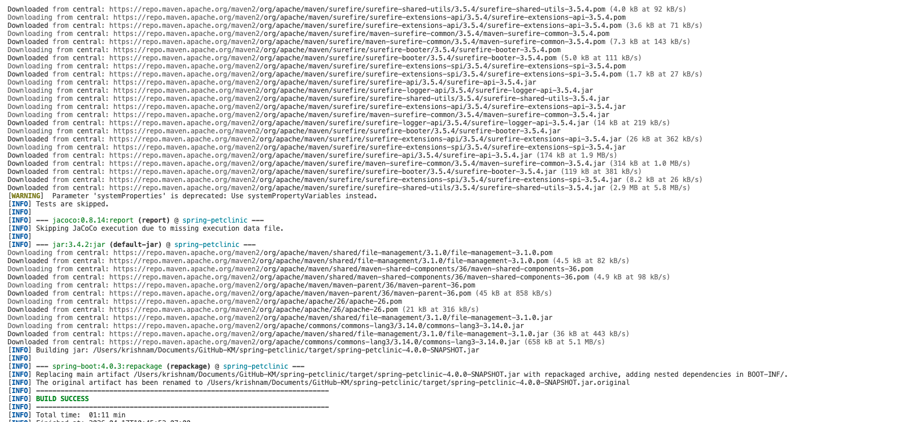

##### Start the app
```bash
./KRISHNA/exec.sh
```
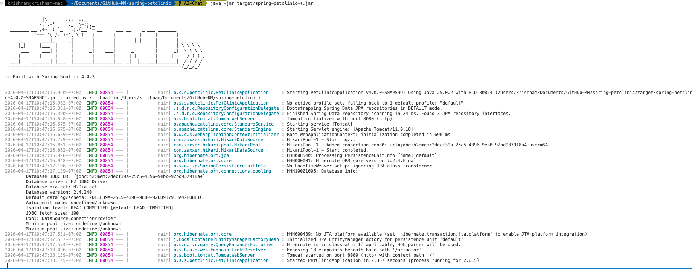

Open [http://localhost:8080](http://localhost:8080).  
The green 🐾 button appears bottom-right. The header shows the active model name.

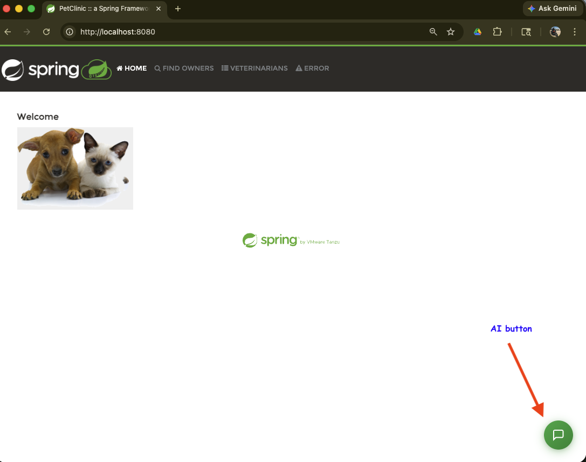
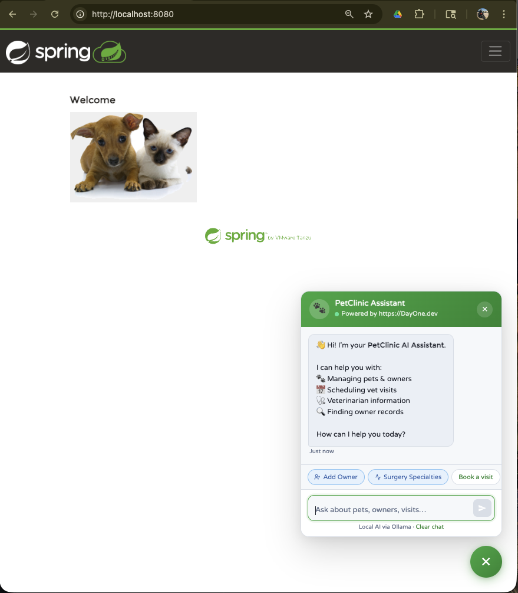
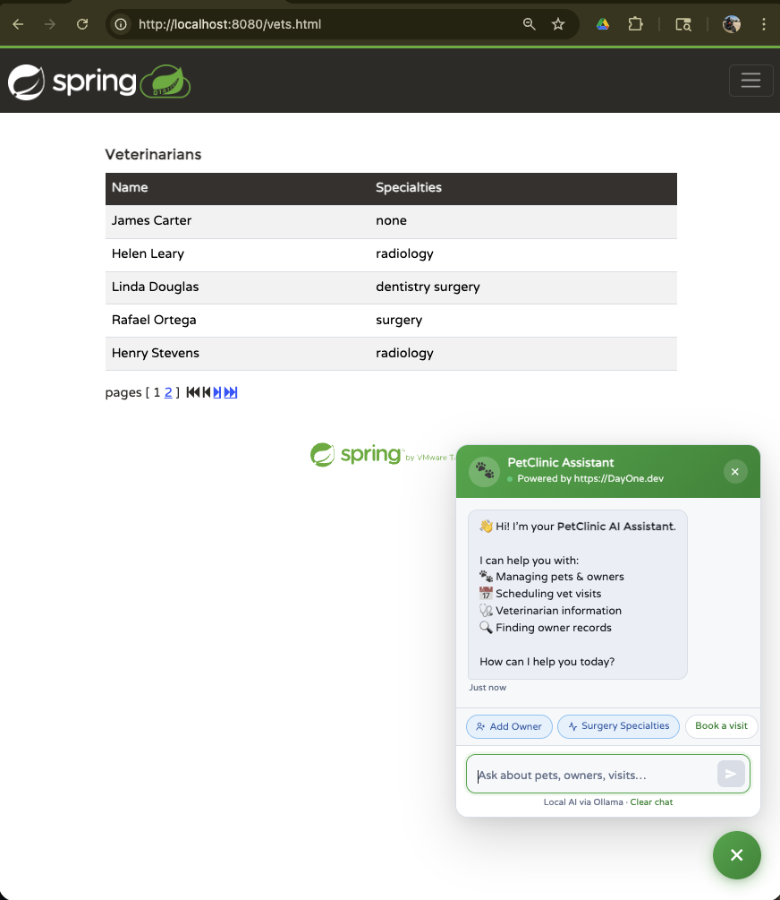
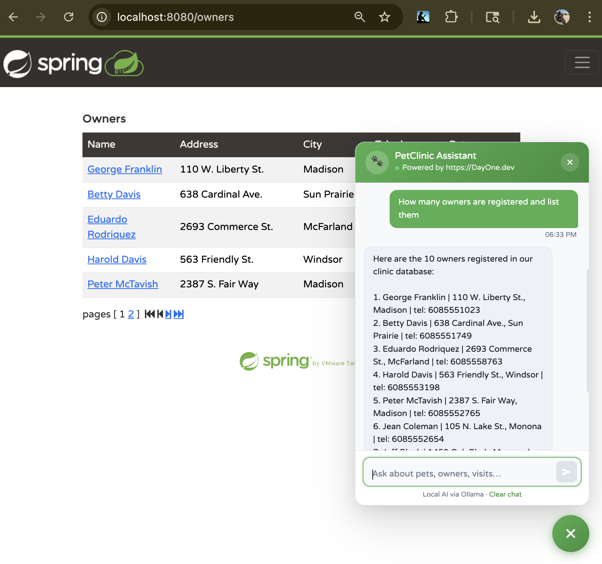
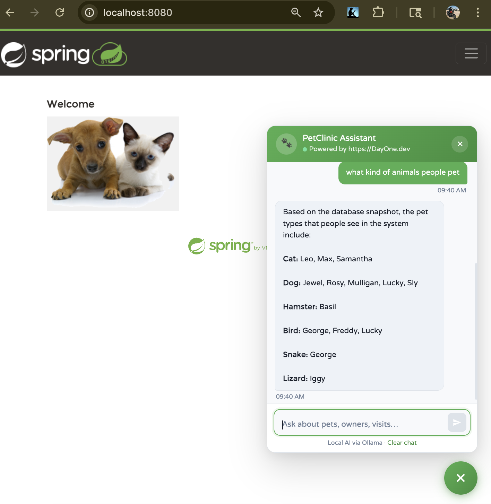

##### Stop the app
```bash
./KRISHNA/exec.sh stop
```
---

### Validate Ollama is working (before starting the app)
##### Check the service is up
```bash
curl http://localhost:11434/api/tags
```
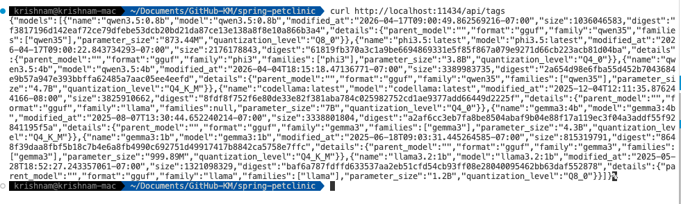

##### Quick chat test
```bash
curl http://localhost:11434/api/chat -d '{"model":"qwen3.5:0.8b","messages":[{"role":"user","content":"Hello"}],"stream":false}'
```
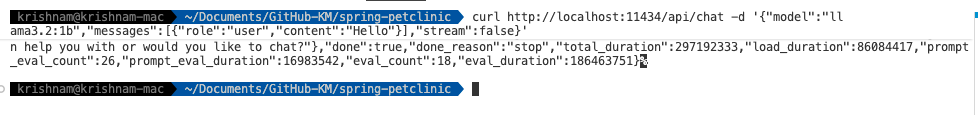

Once the app is running you can also hit the health endpoint:

```bash
curl http://localhost:8080/api/ai/health
# → {"status":"ok","baseUrl":"http://localhost:11434","model":"qwen3.5:0.8b","models":["qwen3.5:0.8b"]}
```
---
### Troubleshooting

| Symptom | Fix |
|---------|-----|
| Header shows "Ollama offline" | Run `ollama serve` |
| Chat replies with error | Check `ollama.model` matches a pulled model (`ollama list`) |
| Very slow replies | Switch to a smaller model (`phi3`) or reduce context |
| Port conflict | Change `ollama.base-url` to match your Ollama port |

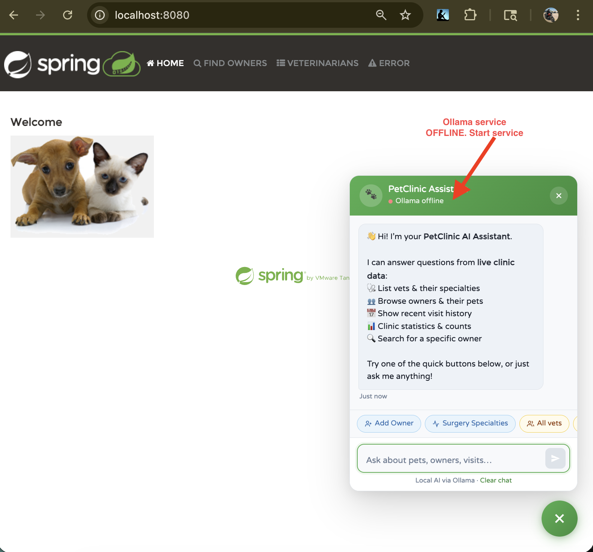

[](https://youtu.be/twOMZL-W8RA) 
---
---

## Feature 2: AI Chat Memory 

The AI Chat feature now includes **persistent conversation memory** across page reloads and sessions. Conversations are automatically saved to:
 - **LocalStorage** (browser) - for immediate session recovery
   - Each session stores messages as JSON string
   - Typically efficient for sessions under 100 messages
   - Auto-cleanup recommended for long-running sessions
 - **Database** - for permanent conversation history
   - Indexes on `session_token` and `updated_at` ensure fast queries
   - Messages are eagerly fetched with session (optimize if needed)
   - Consider archival strategy for old sessions (manual cleanup available)

### Architecture
```
User Types Message
    ↓
Frontend: Add to history array + save to localStorage
    ↓
Frontend: POST /api/ai/chat with {messages, sessionToken}
    ↓
Backend: Load/create ChatSession
    ↓
Backend: Send to Ollama
    ↓
Backend: Save user message + assistant response to database
    ↓
Backend: Return {reply, sessionToken}
    ↓
Frontend: Update display + save to localStorage
    ↓
Page Reload: localStorage restored → conversation continues
```

### Feature code
 - New files:
     - src/main/java/org/springframework/samples/petclinic/ai/memory/ChatSession.java
     - src/main/java/org/springframework/samples/petclinic/ai/memory/ChatMessage.java
     - src/main/java/org/springframework/samples/petclinic/ai/memory/ChatSessionRepository.java
     - src/main/java/org/springframework/samples/petclinic/ai/memory/ChatMessageRepository.java
 - Updated files:
     - src/main/java/org/springframework/samples/petclinic/ai/system/AiChatController.java
     - src/main/java/org/springframework/samples/petclinic/ai/system/AiContextService.java
     - src/main/resources/templates/fragments/ai-chat.html 
     - src/main/resources/db/h2/schema.sql
     - src/main/resources/db/mysql/schema.sql
     - src/main/resources/db/postgres/schema.sql

#### Database
##### New Tables
 - `ai_chat_sessions` - Stores conversation metadata
 - `ai_chat_messages` - Stores individual messages

##### New Indexes
 - `ai_chat_sessions(session_token)` - Fast session lookup
 - `ai_chat_sessions(updated_at)` - Sort by recency
 - `ai_chat_messages(session_id)` - Get messages for session
 - `ai_chat_messages(created_at)` - Chronological ordering


## Testing Recommendations

### Manual Testing
1. Open chat and send a message
2. Refresh the page - message history should persist
3. Click "Clear chat" - history should be cleared
4. Check browser DevTools > Application > Local Storage
5. Call `/api/ai/sessions` to verify backend persistence

### API Testing
#### Chat with Session Persistence
```bash
curl -X POST http://localhost:8080/api/ai/chat \
  -H "Content-Type: application/json" \
  -d '{
    "messages": [
      {"role": "user", "content": "What pets do we have?"}
    ],
    "sessionToken": "550e8400-e29b-41d4-a716-446655440000"
  }'
```
Response:
```json
{
  "reply": "Based on our clinic data...",
  "sessionToken": "550e8400-e29b-41d4-a716-446655440000"
}
```
#### List sessions
```bash
curl http://localhost:8080/api/ai/sessions
```
#### List Recent Sessions
```bash
curl http://localhost:8080/api/ai/sessions?limit=10
```
#### Get a session (replace TOKEN)
```bash
curl http://localhost:8080/api/ai/sessions/{TOKEN}
```
#### Get Conversation History
```bash
curl http://localhost:8080/api/ai/sessions/550e8400-e29b-41d4-a716-446655440000
```
#### Delete a session
```bash
curl -X POST http://localhost:8080/api/ai/sessions/{TOKEN}/delete
```


#### Performance Considerations
#### Database
- Message retrieval is O(1) on session_token
- Session listing is O(log n) with index on updated_at
- Cascade delete ensures no orphaned messages

#### LocalStorage
- Efficient for sessions < 100 messages
- JSON parsing/serialization is fast for typical chat volumes
- Auto-persists after each exchange

#### Recommendations
- Archive old sessions after 30 days (optional cleanup task)
- Monitor database growth for high-volume usage
- Consider message pagination for sessions with 100+ messages

---
---
